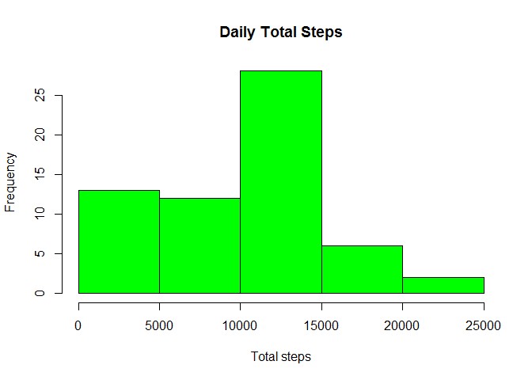
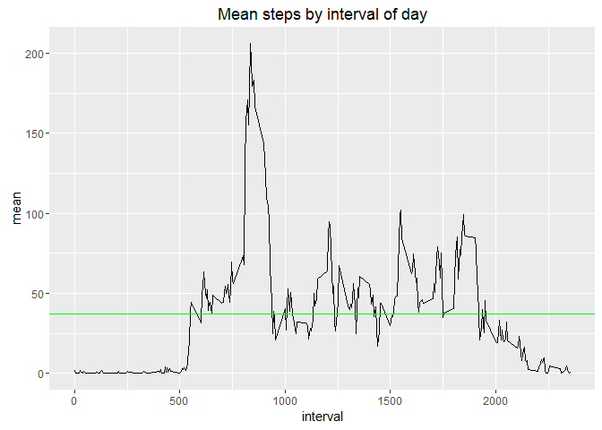
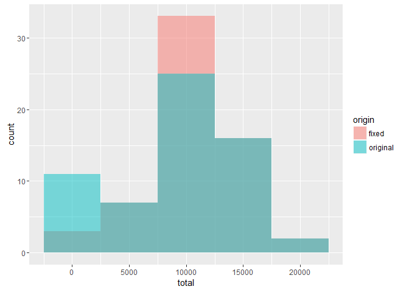
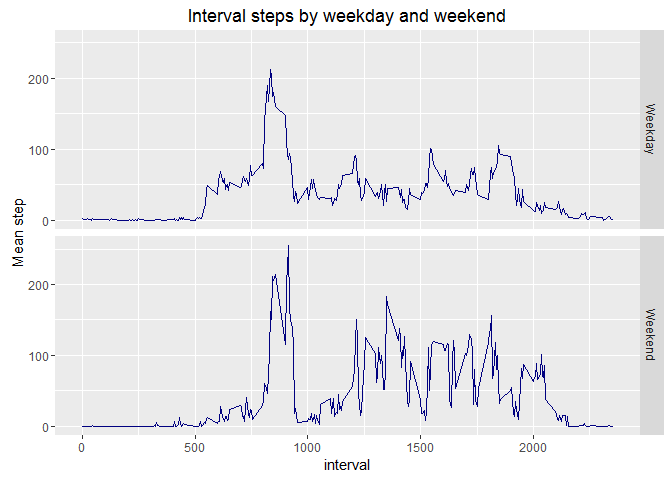

Monitoring Activities- coursera proyect
================
Luis Espinosa Bouvy
22 de octubre de 2016

GENERAL REPORT FOR MONITORING ACTIVITIES
========================================

Loading and cleaning data
-------------------------

Loading and cleaning data requires reading a csv containing the information
from a zip file and giving some variables the correct format so as loading
the required libraries.

``` r
#libraries
     library(ggplot2)
     library(dplyr)
```

    ## 
    ## Attaching package: 'dplyr'

    ## The following objects are masked from 'package:stats':
    ## 
    ##     filter, lag

    ## The following objects are masked from 'package:base':
    ## 
    ##     intersect, setdiff, setequal, union

``` r
     ##reading zip and data
     datos <- read.csv(unz("activity.zip", "activity.csv"))
     datos[,2] = as.Date(as.character(datos[,2]))
```

The total steps taken per day where:

``` r
     by.day <- group_by(datos, date)%>%
          summarise("total" = sum(steps, na.rm=T))

     #histogram steps by day
     hist(by.day$total, col = "green", 
          main = "Daily Total Steps", xlab = "Total steps")
```



``` r
     #mean and median
     mean(by.day$total)
```

    ## [1] 9354.23

``` r
     median(by.day$total)
```

    ## [1] 10395

The average daily activity pattern for each 5 min interval is show in the
following plot.

``` r
     by.interval <- group_by(datos, interval)%>%
          summarise("mean" = mean(steps, na.rm=T))
     media <- mean(by.interval$mean)
     #time series
     qplot(interval, mean, data = by.interval, geom = "line",
           main = "Mean steps by interval of day") + 
          geom_hline(yintercept =  mean(by.interval$mean), 
                     col = "green")
```



The interval with the maximum mean steps is **835**

The data includes NA values

``` r
#missing values
     sum(is.na(datos$steps))
```

    ## [1] 2304

The missing values were treated as follows:
1. Found the mean steps for each interval 2. Replaced NA values with mean steps of the interval

``` r
    #missing values
     sum(is.na(datos$steps))
```

    ## [1] 2304

``` r
     #fill the missing values by interval using average of same interval
     #of other days
     by.interval <- group_by(datos, interval)%>%
          summarise("media" = round(mean(steps, na.rm=T), digits = 0))
     a <- merge(datos, by.interval, by = "interval")
     for.plot <- mutate(a, "fixed" = ifelse(is.na(a[,2]),media,steps))
     fixed.datos <- for.plot%>%
          select(interval, fixed, date)%>%
          rename("steps" = fixed)
     
     ##fixed data without NA's
     fixed.by.day <- group_by(fixed.datos, date)%>%
          summarise("total" = sum(steps, na.rm=T))

     #original data
     by.day <- group_by(datos, date)%>%
          summarise("total" = sum(steps, na.rm=T))
```

Mean and median for original data are:

``` r
     #mean and median
     mean(fixed.by.day$total)
```

    ## [1] 10765.64

``` r
     median(fixed.by.day$total)
```

    ## [1] 10762

After computing NA's mean and median are:

``` r
     #mean and median
     mean(by.day$total)
```

    ## [1] 9354.23

``` r
     median(by.day$total)
```

    ## [1] 10395

Check the following plot to see the differences, the data is now more
centralized, because of the strategy.

``` r
     #table for plotting
     by.day$origin <- "original"
     fixed.by.day$origin <- "fixed"
     for.plot <- rbind(by.day, fixed.by.day)
     #histogram steps by day
     ggplot(for.plot, aes(total, fill = origin)) + 
          geom_histogram(alpha = .5, position = 'identity',
                         binwidth = 5000) 
```



Making reference for the activities between weekday and weekends we can
see no big differences

``` r
     #fill the missing values by interval using average of same interval
     #of other days
     by.interval <- group_by(datos, interval)%>%
          summarise("media" = round(mean(steps, na.rm=T), digits = 0))
     a <- merge(datos, by.interval, by = "interval")
     for.plot <- mutate(a, "fixed" = ifelse(is.na(a[,2]),media,steps))
     fixed.datos <- for.plot%>%
          select(interval, fixed, date)%>%
          rename("steps" = fixed)
     fixed.datos$weekday <- as.POSIXlt(fixed.datos$date)$wday
     fixed.datos$type <- ifelse(fixed.datos$weekday > 5,"Weekend","Weekday")
     fixed.datos$type = as.factor(fixed.datos$type)
     
     ##summary
     for.plot <- fixed.datos%>%
          group_by(type, interval)%>%
          summarise("mean.steps" = mean(steps))
     
     #plotting
     ggplot(data = for.plot, aes(interval, mean.steps)) + 
          geom_line() + facet_grid(type~.) + geom_path(colour = "navy") +
          ylab("Mean step") + 
          ggtitle("Interval steps by weekday and weekend")
```


